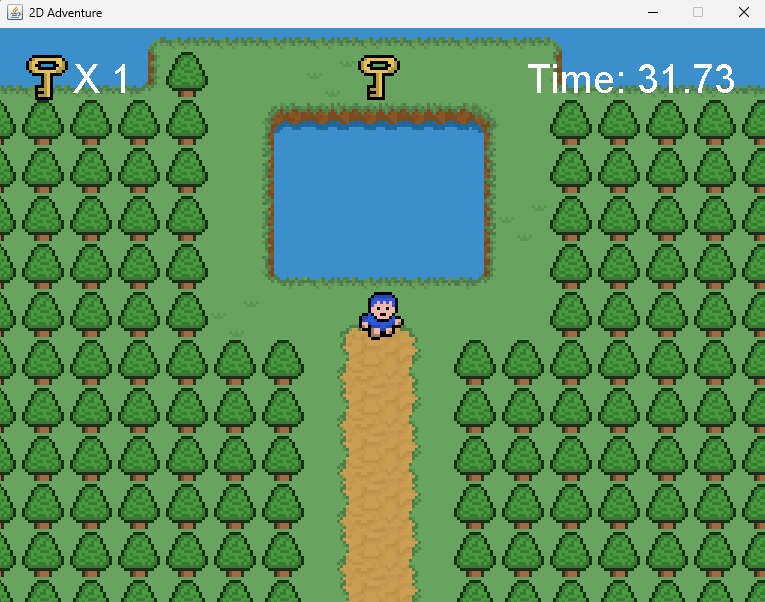

  <h1>🎮 Java 2D Adventure Engine</h1>
  
<em>A tile-based 2D adventure game built from scratch</em>

  

 

## 📸 Game

  
   
   
  <em>Exploring the world, managing inventory, and interacting with the environment.</em>

 

## 🛠️ Technical Overview

Focusing on game development with Java (Standard Edition), this project features a hand-crafted engine that manages the typical challenges of 2D real-time applications.

### 🚀 Core Systems
<ul>
  <li><strong>Tile Management:</strong> Efficient rendering system for world-building using custom map files.</li>
  <li><strong>Entity & Player Logic:</strong> Handling movement, sprite animation, and environment interaction.</li>
  <li><strong>Collision Physics:</strong> A dedicated <code>CollisionChecker</code> class to handle world boundaries and solid objects.</li>
  <li><strong>Sound Engine:</strong> Integrated <code>.wav</code> support for background music and situational sound effects.</li>
  <li><strong>UI/UX:</strong> Real-time HUD showing player stats like health and inventory elements.</li>
</ul>

 
